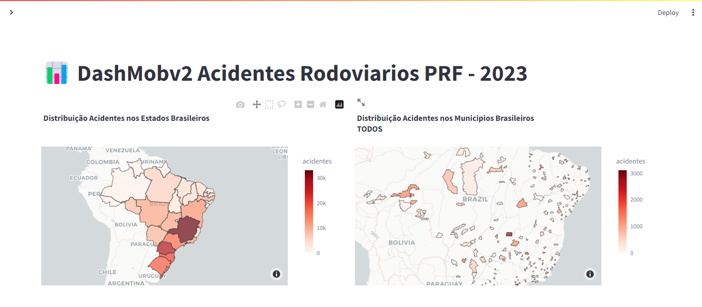
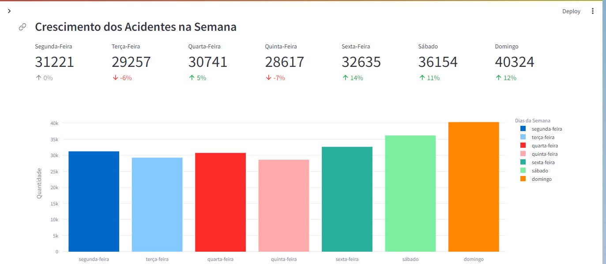
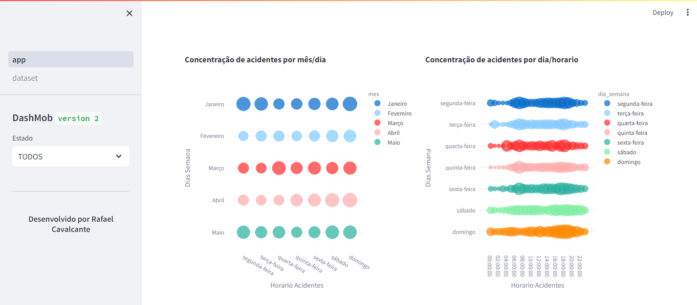

# Dashboard Acidentes PRF - 2023

## libraries

- [Pandas](https://pandas.pydata.org/) - Is a fast, powerful, flexible and easy to use open source data analysis and manipulation tool, built on top of the Python programming language.

- [Plotly](https://plotly.com/graphing-libraries/) - Interactive charts and maps for Python, R, Julia, Javascript, ggplot2, F#, MATLAB®, and Dash.

- [Streamlit](https://streamlit.io/) - Streamlit turns data scripts into shareable web apps in minutes.
All in pure Python. No front‑end experience required.

## Sample Code

``` bash
pip install pandas

pip install plotly

pip install streamlit

pip install missingno
```

## Executar o projeto

``` bash

streamlit run 1_app.py

```

## Screenshot
&nbsp;
&nbsp;
